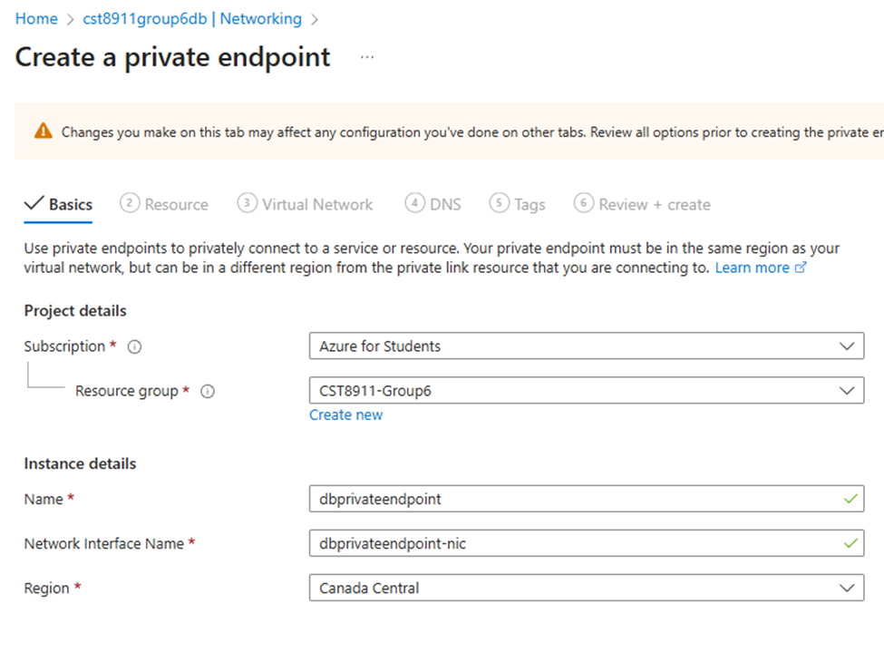
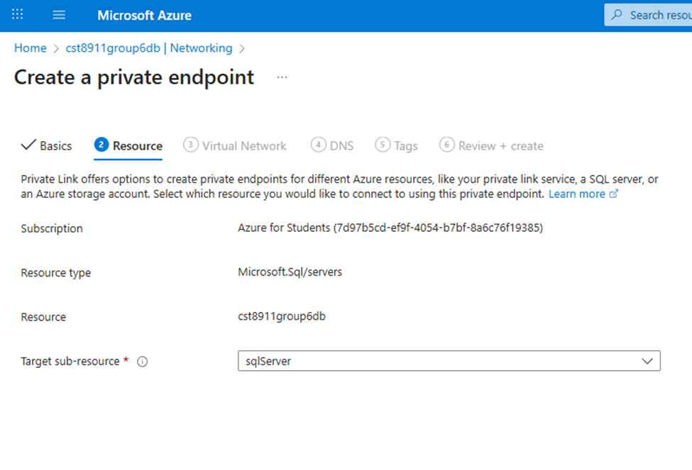
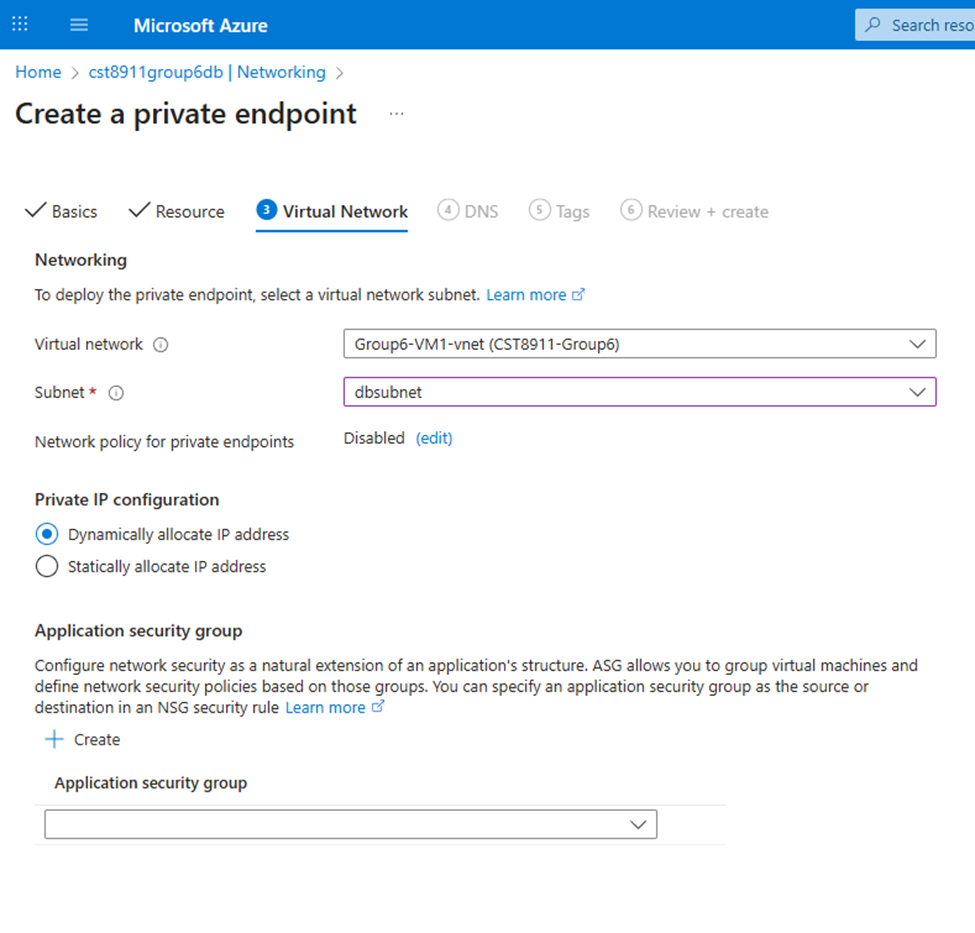
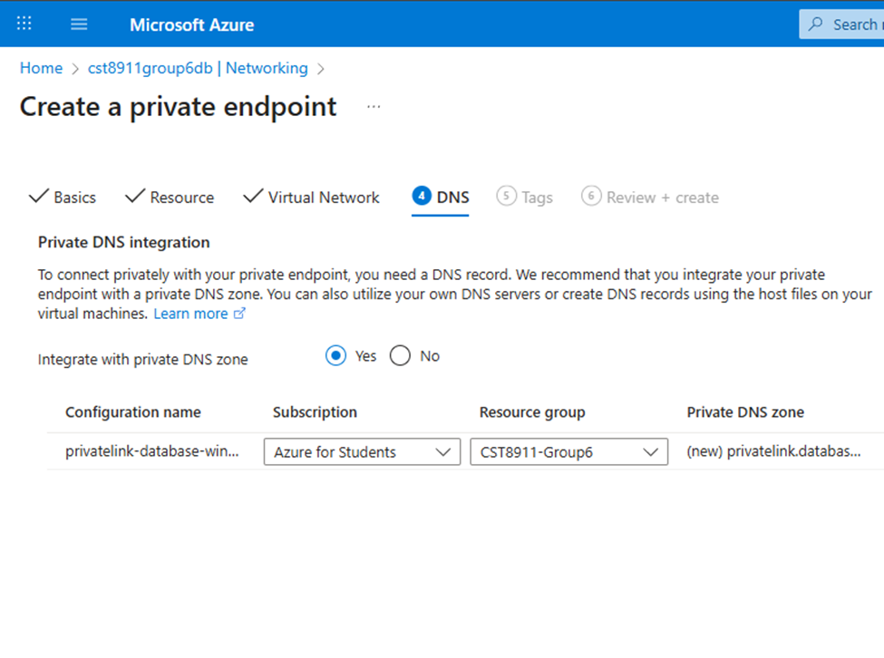
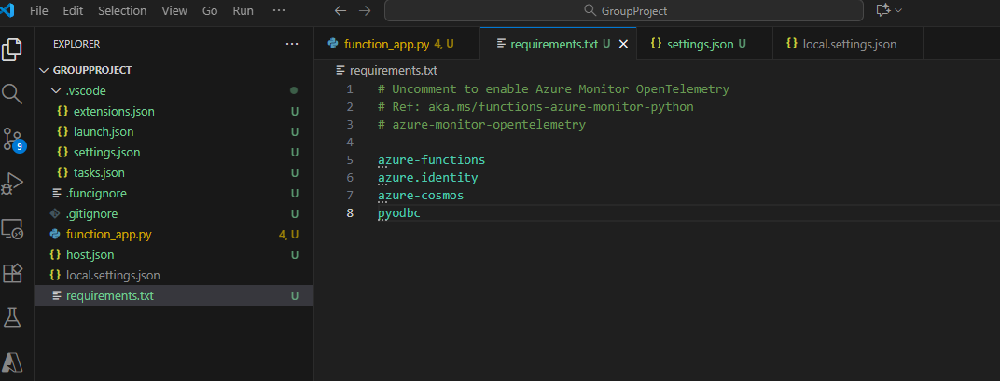

# 25F_CST8911 Group 6: Midterm Project

## Students:

- Durham Olga - 040687883 - shap0011@algonqionlive.com
- Heallis Dom - heal0076@algonquinlive.com
- Mendoza Jediael - 041208322 - mend0214@algonquinlive.com
- Parsons Matthew - pars0230@algonquinlive.com
- Saini Saizal - 041168394 - sain0225@algonquinlive.com

## Report

### Virtual machine

Create a virtual machine, US East region is not available for some services so we are going to use Canada Central region and keep it consistent for Azure Function App and Cosmos DB as well.

Fill up the basic information for the virtual machine.We select our student subscription, create a new resource group named "CST8911-Group6", name our virtual machine Group6-VM1, select Canada Central, and choose Windows Server 2022. We're using this image because it is cheap and also allows us to install Postman to test our Function App later.

Select image size of "Standard_B2als" which has 2vcpus and 4Gib memory. We're using this image and size because it is the cheapest option that allows us to install Postman to test our Function App later and to login to Azure portal to manage our database. We tested cheaper image sizes but the virtual machines crashes from openning a browser. We created an administrator account to login through Bastion later.

We created a virtual network named Group6-VM1-vnet, and leave the other options default.

Create and deploy the virtual machine.

### Cosmos DB Setup

We created a Cosmos DB for NoSQL database, we used Learning workload type because we are only going to handle small amount of data for testing, put the database in the same resource group as before, named it "group6cosmodb", and select Canada Central region. We use serverless to minimize cost because we're only going to be using the datase when the function application is running and will be paused for most of the time.

Leave these default.

### Function App

### Networking

### Environment Setup

### Testing

