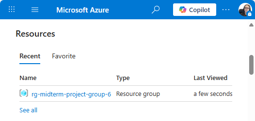

# 25F_CST8911 Group 6 Midterm Project (Olga Durham draft)

## Scenario 1

In azure, deploy virtual machines(select the cheapest options) then manage them using the respective platform's management tools.

Students must then create an Azure Function app and configure it to use a database (e.g., Cosmos DB).

Then, implement a RESTful API using Azure Functions to interact with the database.

Implement an authentication mechanism for the API using Azure Active Directory (AAD) and OAuth 2.0.

Finally, deploy the Azure Function app and test the API using a tool like Postman.

The students will be evaluated on their ability to configure, secure, and optimize the virtual machines, azure functions, and databases. Following correct security protocols and best practices.

---

## Pre Requirements

- Azure subscription with _Azure for Stugents_
- Install:
  - Azure CLI
  - Functions Core Tools
  - Git
  - Postman
- Pick the closest region to reduce latency/cost: _Canada Central_

## Set up the Resource Group

The resource group created

<table>
  <tr>
    <td></td>
    <td></td>
    <td></td>
  </tr>
</table>

---

## Creating a new storage account

<table>
  <tr>
    <td></td>
    <td></td>
    <td></td>
  </tr>
</table>

Connecting terminal to Azure Cloud Shell

Switch subscription in Cloud Shell and register provider

---

## Create a Standard Public IP and run the Virtual Machine

Public IP created, VM is running

---

## Add the PC’s SSH key to the VM + lock NSG to the home IP

### Create an SSH key

Public key generated

The entire public key

